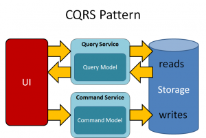

    Command Query Responsibility Segregation (CQRS) pattern

 

 <h5>Example<h5/>

The following code shows some extracts from an example of a CQRS implementation that uses different definitions for the read and the write models. The model interfaces don't dictate any features of the underlying data stores, and they can evolve and be fine-tuned independently because these interfaces are separated.

The system uses the ```ProductCommandHandlers``` class to handle commands sent by the application for product entity.

```csharp
public class ProductCommandHandlers 
        : ICommandHandler<CreateProductCommand>,
        ICommandHandler<XXXCommand>,
        ...
    {
        private readonly ICommandRepository<Product> _commandProductRepository;

        public ProductCommandHandlers(ICommandRepository<Product> commandProductRepository)
        {
            _commandProductRepository = commandProductRepository;
        }

        public void Execute(CreateProductCommand command)
        {
            ...
        }

        public void Execute(XXXCommand command)
        {
            ...
        }
        ...
    }
```
<br/>

 The system uses the ```ProductQueryHandlers``` class to handle queries get by the application for product entity.
```csharp
public class ProductQueryHandlers 
        : IQueryHandler<GetProductByIdQuery, GetProductByIdResult>,
        IQueryHandler<SearchProductQuery, SearchProductResult>,
        ...
    {
        private readonly IQueryRepository<Product> _queryProductRepository;
        public ProductQueryHandlers(IQueryRepository<Product> queryProductRepository)
        {
            _queryProductRepository = queryProductRepository;
        }

        public GetProductByIdResult Query(GetProductByIdQuery query)
        {
            ...
        }

        public SearchProductResult Query(SearchProductQuery query)
        {
            ...
        }
        ...
    }
```

<br/>
<h5>References</h5>

- The post [CQRS by Martin Fowler](https://martinfowler.com/bliki/CQRS.html) which explains the basics of the pattern and links to other useful resources.

- The patterns & practices guide Microsoft doc. In particular, [Introducing the Command Query Responsibility Segregation pattern](https://docs.microsoft.com/en-us/azure/architecture/patterns/cqrs) explores

- Pattern: Command Query Responsibility Segregation (CQRS) [by Chris Richardson](https://microservices.io/patterns/data/cqrs.html)
